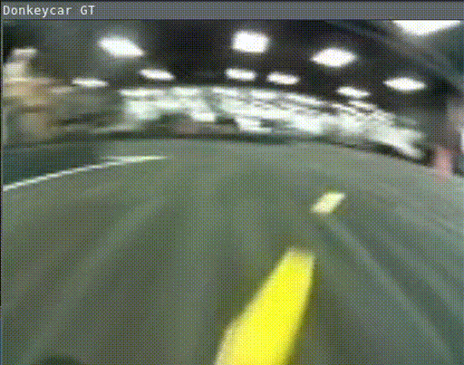
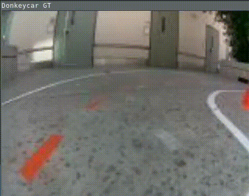

## DonkeyCarGT: Donkey Car, C++ and You 

This is the very early stage of an implementation of Donkey Car components in modern C++.

- [Donkey Car is a self-driving car platform for hobby remote-control cars](https://www.donkeycar.com/).
- Why? Good times.

|    |    |
:---:|:---:
 | 

### Noteworthy
- Polymorphic architecture between `Vehicle` and `Part` (Parts are cameras, networks, computer vision components, etc).
- Smart-pointer, generic, polymorphic architecture for `Part` input and output data. The implementation of a Part may operate on a specific data type, e.g. a `donkeycar::Image` or may need to be generic to operate on multiple data types, e.g. `NetworkPublisherMqtt<Pose>`, `NetworkPublisherMqtt<Image>`.  This is supported.
- Native, _managed_, thread support within Parts. A Part _is_ a `pthread` that can be paused, resumed and joined with grace and care.
- Thread-safe, locked hashtable for Part I/O data passing, sharing and storage.

### Status
- [X] Architecture between `Vehicle` and `Part`
- [X] Architecture for `Part` input and output data.
- [X] Parts as managed threads 
- [X] Part I/O data storage and sharing
- [X] Initial Support for Camera Parts: `ImageListCamera` (for iterating over `Tub` jpegs from disk) and a generic webcam `WebCamera`
- [X] Throttle the `Vehicle` run loop to a specified frequency
- [X] Significant unit-test coverage (always a WIP)
- [X] `.clang-format` all code
- [ ] Autonomy support for CV-based line-following (WIP)
- [ ] Autonomy support for the Imitation Learning keras/TF-lite model
- [ ] Support for Network Parts (mqtt and zmq with pub/sub semantics)
- [ ] Support for Tub_v2
- [ ] GPIO HW support
- [ ] ...

### Building

Docker is effectively required, unless you're already working with:
- Tensorflow v2.13.0
- OpenCV >= 4.6.0

```bash
# Build the image
./build-image.sh

# Edit the paths within this script, then run the container
./run-image.sh

# Build donkeycarGT by making a build directory (i.e. `build/`), run `cmake` in that dir, and then use `make` to build the desired target.
mkdir build && cd build
cmake .. -DCMAKE_BUILD_TYPE=[Debug | Coverage | Release] -DTFLITE_ENABLE_XNNPACK=OFF
# or to modify the graph at runtime with the TFLite GPU delegate
# cmake .. -DCMAKE_BUILD_TYPE=[Debug | Coverage | Release] -DTFLITE_ENABLE_XNNPACK=OFF -DTFLITE_ENABLE_GPU=ON

make
./donkeyCarGT
make test      # Makes and runs the tests.
make coverage  # Generate a coverage report.
make doc       # Generate html documentation.
```
